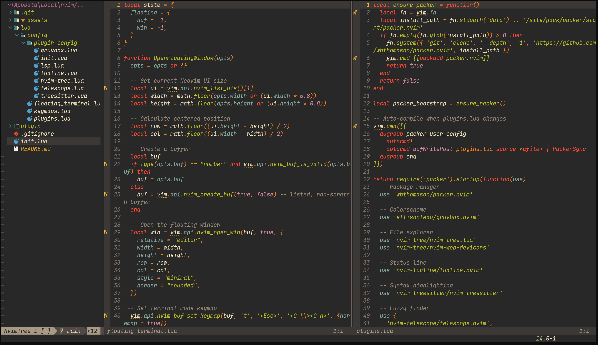
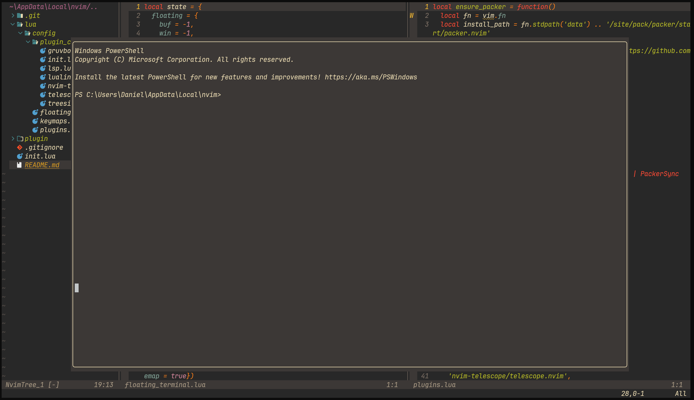

# 🚀 Modern Neovim Config

## Neovim Setup Preview

## Features
- 🌈 Gruvbox colorscheme
- 🔍 Telescope fuzzy search
- 💡 LSP & autocompletion
- 🧠 Treesitter syntax
- 🗂️ File explorer (nvim-tree)
- 🖥️ Floating terminal

## 🔑⌨️ Key Mappings Guide

### Leader Key
- **Leader key:** `<Space>`

### Window Navigation
- `<Alt-j>` — Move to window below 
- `<Alt-k>` — Move to window above 
- `<Alt-h>` — Move to window left  
- `<Alt-l>` — Move to window right 
- `<Alt-j>` — Move to window below 
- `<Alt-k>` — Move to window above 
- `<Alt-h>` — Move to window left  
- `<Alt-l>` — Move to window right 

### Window Splitting
- `<leader>sv` — Vertical split  
- `<leader>sh` — Horizontal split  

### Floating Terminal
- `<leader>t` — Toggle floating terminal (in normal mode)
- `<ESC>`     — To normal mode
- `<i>`       — Insert mode

### File Explorer (nvim-tree) Navigation
- `L` on a **folder** — Step into the folder (change root and reload view)
- `L` on a **file** — Open the file
- `H` — Step back to the parent folder (change root to parent and reload)

### File Finder
- `<leader>ff` — Fuzzy find files (Telescope)

## 🛠️ Installation Guide

### Prerequisit:

- Neovim
- Node.js (for LSP)

### Install:

#### psh
- git clone https://github.com/Daniel-Aridi/nvim-config.git "$env:LOCALAPPDATA\nvim"
#### cmd
- git clone https://github.com/Daniel-Aridi/nvim-config.git "%LOCALAPPDATA%\nvim"
#### macOS/Linux
- git clone https://github.com/Daniel-Aridi/nvim-config.git ~/.config/nvim
